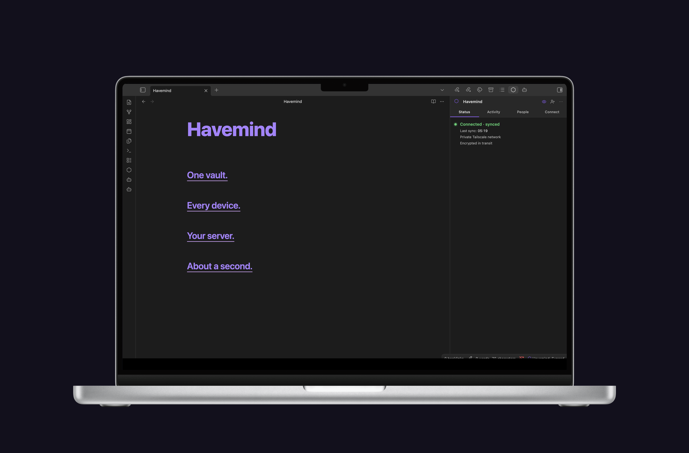
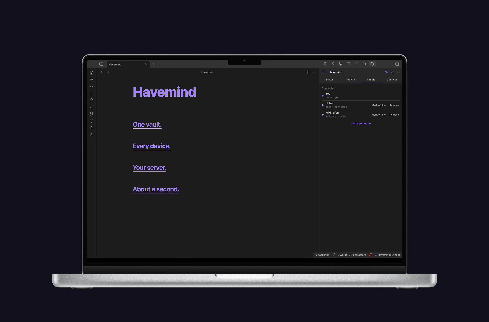
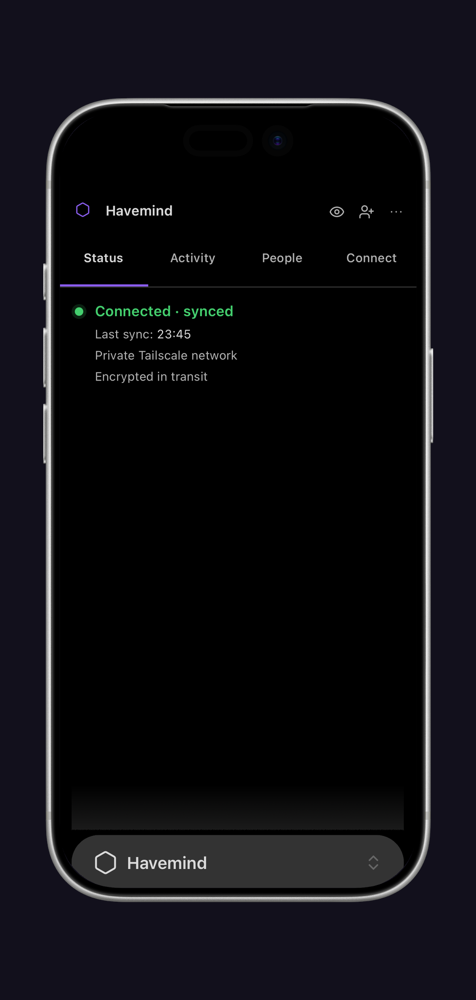

<p align="center">
  
</p>

<p align="center">
  
</p>

# Havemind

### Share one Obsidian vault with people you trust.

Havemind is self-hosted sync for [Obsidian](https://obsidian.md), built for two
or three people sharing one vault. Everyone keeps a normal local copy. A server
you own passes the changes around and remembers who wrote what.

Built for people. If you also run Claude, MCP or another local agent in that
vault, its edits land in the same history.

**Version 1.5.0, desktop and mobile.** A two-week pilot on two devices lost no
data, including through three real incidents.

There is no end-to-end encryption. Your server stores the vault in plaintext,
so whoever runs that machine can read it. Read the
[security model](#security-model) before you connect a vault you care about.

**Self-hosting your own instance?** See
[docs/self-hosting.md](https://github.com/MikolajSapek/havemind/blob/main/docs/self-hosting.md) for the full zero-to-working
guide (Docker Compose + Tailscale, tailnet-only).

**Connecting Claude or an AI agent?** See
[docs/using-with-ai-agents.md](https://github.com/MikolajSapek/havemind/blob/main/docs/using-with-ai-agents.md) for the
requirements and the steps.

## Install

Havemind needs two things: the plugin, and a server you run.

**The plugin.** In Obsidian, open Settings, then Community plugins, then
Browse, and search for **Havemind**. Install it and enable it. It runs on
macOS, Windows, Linux, iOS and Android, and needs Obsidian 1.11.4 or newer.

**The server.** There is no Havemind cloud to sign up for: you host it, or you
join someone who does. See [Quick start](#quick-start) below.

## Quick start

Two paths, depending on whether you are the one running the server.

### You are hosting

1. **Install Tailscale** on the machine that will run the server, and log in.
   Everyone who syncs joins the same tailnet; that is the whole access
   boundary, and nothing is exposed to the public internet.
2. **Configure and start the server.** From a checkout of this repository,
   `cp deploy/.env.example deploy/.env` and set `HAVEMIND_API_BASE_URL` to the
   HTTPS tailnet URL you will use in step 3; it is baked into the server's
   discovery document, so it has to be right before the first start. Before
   running Compose, complete the [server preparation](docs/self-hosting.md#the-database-key-secret):
   create `/srv/secrets/havemind_db_key` and give uid 1000 ownership of the
   data volume and backup directory. Then run
   `docker compose -f deploy/compose.yaml up -d --build`. You need Docker
   Engine with the Compose v2 plugin.
3. **Put Tailscale in front of it** with `tailscale serve`, so the other
   devices on your tailnet can reach it. Full commands are in the
   [self-hosting guide](https://github.com/MikolajSapek/havemind/blob/main/docs/self-hosting.md).
4. **Create your account.** Run `setup` inside the container, once:

   ```bash
   docker compose -f deploy/compose.yaml exec havemind-server \
     node apps/server/bin/havemind.js setup --owner "Your Name" --vault "My Vault"
   ```

   It prints a single-use pairing token (`hm_pt_...`).
5. **Connect the plugin.** Open the Havemind pane in Obsidian, go to the
   Connect tab, and enter your server's tailnet address
   (`something.tailnet-name.ts.net`) together with that pairing token. The
   Status tab turns green when it is working.
6. **Invite the other person.** People tab, then Invite someone. Send them the
   invitation; it works once.
7. **Approve their device.** They read a 6-digit code aloud to you, you type
   it in. Three attempts. That handshake is what binds their identity, so do
   it by voice, never by message.

The long version, including backups and multiple vaults, is in
[docs/self-hosting.md](https://github.com/MikolajSapek/havemind/blob/main/docs/self-hosting.md).

### You are joining someone else's vault

1. Install Tailscale, log in, and accept the invitation to their tailnet.
2. Install the Havemind plugin in Obsidian.
3. Open the invitation the owner sent you.
4. Your device shows a **6-digit code**. Read it aloud to the owner over a
   call, never in a chat message.
5. Once they approve, the vault syncs. It appears in your Obsidian like any
   other vault.

## What it does

- **One vault, every device.** Mac, Windows, Linux, iPhone, Android. Write on
  the phone, it is on the laptop a couple of seconds later.
- **Nothing is overwritten silently.** Edits that do not overlap merge on their
  own. When two people change the same lines, both versions survive and a copy
  lands in `Havemind Conflicts/`.
- **You can see who wrote what.** Every change in the Activity panel carries a
  name and a colour when the member can be resolved. The author identity comes
  from the server with the revision; unknown authors keep a neutral label.
  The Activity feed holds up to 200 entries in memory and resets when the
  plugin reloads. Its current Restore action only adds an Activity entry; it
  does not restore file contents. Do not use it for recovery.
- **Notes, attachments and how the vault looks.** Markdown with line-level
  history, images and PDFs up to 25 MB, plus your theme, snippets, hotkeys and
  graph settings.
- **Joining takes a phone call.** The new device shows six digits, the owner
  types in what they hear. Three tries. That is what ties a person to a device.

<details>
<summary>The details behind those five</summary>

| | |
|---|---|
| Sync speed | A peer's change lands in about a second over the long-poll channel. An edit waits 1.5 s to settle first, reducing bursts from format-on-save tools. Incompatible formatter settings can still cause churn. Creates, renames and deletes go out immediately. |
| `.obsidian/` scope | An allowlist, nothing more: `themes/`, `snippets/`, `hotkeys.json`, `graph.json`, `appearance.json`, `app.json`, `core-plugins.json`. |
| Attachments | PNG, JPG, GIF, WebP, SVG, PDF, up to 25 MB, byte for byte. |
| Crash safety | The outbox survives a crash. A torn state file is kept as a sidecar and flagged, never dropped. |
| Presence | The owner sees who is connected. A dead session reconnects in one click, no new code. |
| Several vaults | One server, independent vaults. Two teams share a box without seeing each other's data. |
| Backups | Off unless you set `HAVEMIND_BACKUP_DIR`; the shipped compose file sets it. Then a snapshot every 24 h, last 7 kept. Checkpoints are sealed to a public key, so the server that writes one cannot open it. |
| Limits | Storage quota per vault, throttling per device. |

</details>

## What it looks like

<p align="center">
  
</p>

<p align="center">
  
</p>

<p align="center">
  
</p>

## What it will not do

- **Run in our cloud.** There isn't one. The server is your hardware, reachable
  only over your [Tailscale](https://tailscale.com) network.
- **Sync your plugins.** `.obsidian/plugins/` never crosses: not the code, not
  the state, not the `data.json` secrets. Nor does your enabled-plugin list or
  window layout. So nobody can swap out your plugin code and have Obsidian run
  it, and two machines can keep entirely different plugin sets. Blocked paths
  are refused twice, once when a revision is written and again when one
  arrives, so an older peer cannot push what a newer one forbids.
- **Think about your notes.** The server holds blobs and revision headers.
  Diffs, merges and authorship happen on your machine.

## Architecture

```
Obsidian plugin (Vault A) ─┐
                           ├── HTTPS over tailnet ──► opaque server (Fastify + SQLite)
Obsidian plugin (Vault B) ─┘   real-time /wait wake     content-addressed blob store
```

The plugin does the thinking: watching the vault, a durable outbox that
survives a crash, the pull-and-apply loop, three-way merges, conflict copies,
the activity log. Your files are never rewritten to canonicalise them; that
happens on the hash side only.

The server is deliberately dumb. Fastify and SQLite in WAL mode, blobs stored
by content hash, and the long-poll that wakes your other devices. It rotates
refresh tokens and spots reuse, rate-limits per device, holds each vault to its
quota, and sweeps orphaned blobs at startup. Non-root, read-only, capabilities
dropped.

Checkpoints are sealed with libsodium `crypto_box_seal` (X25519). The server
holds only the public half, so it can write an encrypted snapshot and never
open one. The secret key lives in your recovery kit, off the server. Live data
on the volume stays plaintext.

## Security model

Security here rests on Tailscale, not on encryption inside the app. The server
answers only on your private tailnet, never the public internet, and Tailscale
(WireGuard) encrypts everything in transit with per-device authentication.

Between members of a vault, the line is drawn at code. Appearance settings
cross: themes, snippets, hotkeys, `graph.json`, `appearance.json`, `app.json`
and `core-plugins.json`, which toggles Obsidian's own built-in modules.
`.obsidian/plugins/` never crosses. Plugin code, state and secrets stay on the
machine they live on, so one member cannot overwrite another's plugin and have
Obsidian run it on the next reload.

The vault sits on the server in plaintext. **Whoever controls that machine can
read everything.** Run it on hardware you and your people trust, keep it on the
tailnet (never turn on Tailscale Funnel), and treat access to the server as
access to the vault. End-to-end encryption is out of scope on purpose: this is
a small tool for a circle that already trusts each other, not a zero-trust
service. See [known limitations](https://github.com/MikolajSapek/havemind/blob/main/docs/pilot/known-limitations.md) for the
current operational caveats.

## Privacy and permission disclosures

No telemetry, no analytics, no ads, no accounts we operate, no hard-coded
server. The plugin makes its first network request only after you connect a
vault, and none at all while disconnected.

- **Network.** Every request goes to the one HTTPS address you typed when
  connecting. They carry invitations, device authentication, revisions and
  blobs, membership state, and the held long-poll that makes sync feel
  immediate. That server is yours, not ours, and it stores your notes in
  plaintext.
- **Reading your vault.** On first reconciliation and when resolving a
  conflict, the plugin lists vault paths to spot creates, deletes, renames and
  conflicts. It reads and sends only notes, allowed attachments, and the
  `.obsidian/` appearance allowlist above.
- **Clipboard.** Write-only, once, when the owner presses Copy invitation. The
  plugin never reads your clipboard and never logs the invitation.
- **Base64.** A transport encoding for binary payloads. Not encryption, not
  obfuscation, and not a way to hide code or URLs.

The Community directory asks for network use to be spelled out in the README,
which is why this section exists.

## Documents

**If you are running it**

- [Self-hosting guide](https://github.com/MikolajSapek/havemind/blob/main/docs/self-hosting.md), zero to working server
- [Current limitations](https://github.com/MikolajSapek/havemind/blob/main/docs/pilot/known-limitations.md), the caveats that bite
- [Using it with AI agents](https://github.com/MikolajSapek/havemind/blob/main/docs/using-with-ai-agents.md)

**If you are working on it**

- [Technical plan](https://github.com/MikolajSapek/havemind/blob/main/plans/001-technical-plan.md), the architecture and the
  engineering contract
- [MVP spec](https://github.com/MikolajSapek/havemind/blob/main/specs/001-mvp.md), what the product promised to be
- [Contributing](CONTRIBUTING.md) and [decisions](https://github.com/MikolajSapek/havemind/blob/main/DECISIONS.md)

## Local verification

Requires Node.js 22 and npm 10.

```bash
npm ci
npm run verify      # workspace/release checks, lint, typecheck, all tests, build
npm run test:e2e     # run only the two-device tests (also included in verify)
npm run test:coverage # coverage thresholds, checked separately in CI
```

`npm run verify` is the baseline local check before a release. CI also checks
coverage, design tokens, the generated plugin class list, release artifacts
and private-infrastructure markers; a passing local verify does not replace
a passing CI run. The individual steps (`npm run build`, `npm run typecheck`,
`npm run lint`, `npm test`) are still there when you want to run just one.

Do not point a development build at an existing important vault. Use a dedicated
test vault for development and automated testing.
